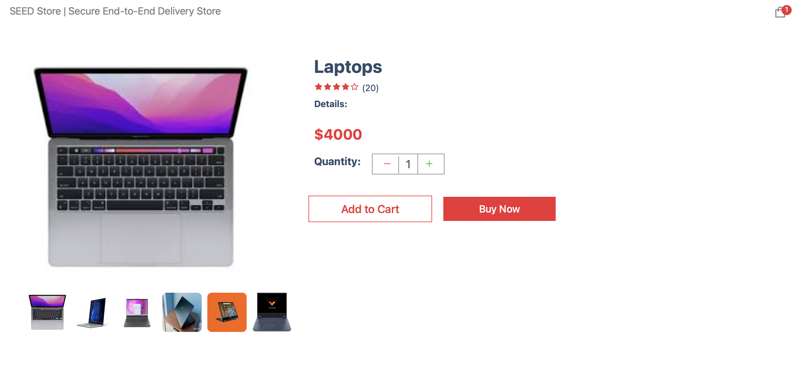
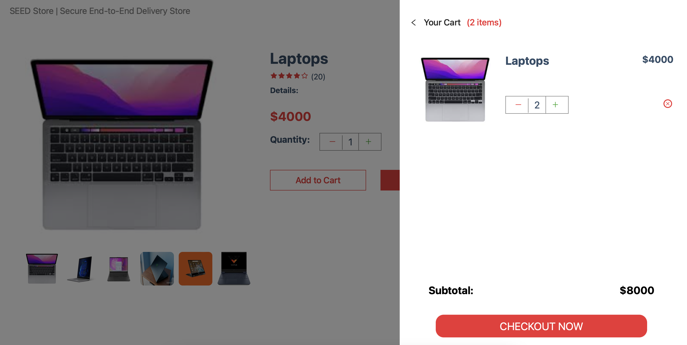
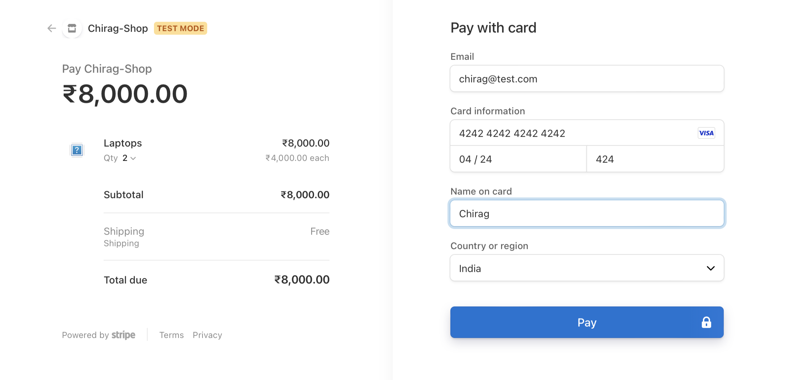
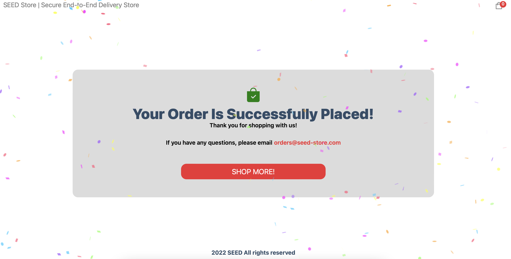
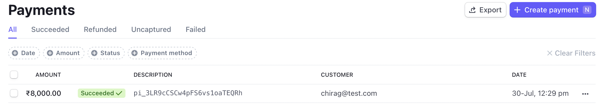
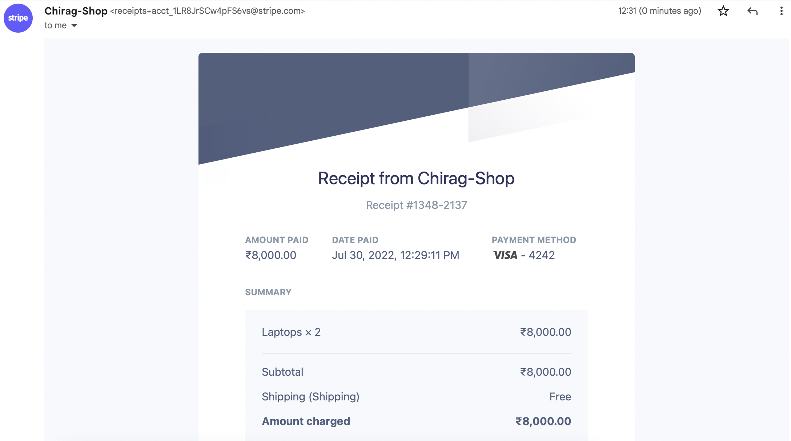

## Getting Started

To clone the repository use
```bash
git clone https://github.com/chirag-ganguli/seed-store
```

To run the development server:

```bash
npm run dev
# or
yarn dev
```

Open [http://localhost:3000](http://localhost:3000) with your browser to see the results.

It should look somthing like:


Click on a Product to Add to Cart:



Select the Quantity and Click on Checkout to Continue with the Purchase:



Enter your details to forward payment:



Your order is successfully placed!



The order is displayed in the shopkeepers payment portal:



An email is auto-sent to the shopper by Stripe on successful purchase:




## Deploy on Vercel

The easiest way to deploy a Next.js app is to use the [Vercel Platform](https://vercel.com/new?utm_medium=default-template&filter=next.js&utm_source=create-next-app&utm_campaign=create-next-app-readme) from the creators of Next.js.

#### Note:

This is my very first Project using React so kudos to the Krypto Team for this opportunity.
<br>
This project is inspired from JavaScript Mastery Course.

###### Presented by:
Chirag Ganguli